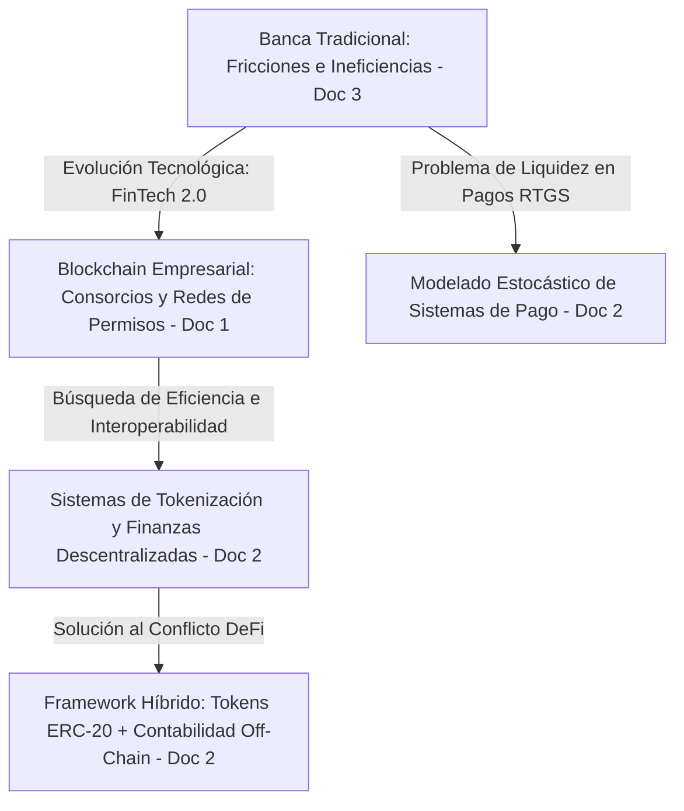

# Análisis en Profundidad: Blockchain en Empresas, Tokenización de Activos Financieros y Transformación Bancaria

Este documento recopila un estudio exhaustivo y detallado de tres publicaciones clave sobre el uso de la tecnología blockchain en el sector empresarial, la banca tradicional y los mercados financieros descentralizados. A continuación, se desglosa el contenido y entendimiento técnico de cada uno de ellos.

---

## 1. Documento 1: Blockchain for Enterprise: Overview, Opportunities and Challenges
*__Autores:__ Elyes Ben Hamida, Kei Leo Brousmiche, Hugo Levard, Eric Thea (SystemX / SQLI, Francia)*

Este artículo analiza los componentes principales, tecnologías, aplicaciones y desafíos de investigación de las redes blockchain enfocadas en entornos empresariales (especialmente privadas y de consorcio).

### 1.1. Contexto y Clasificación de Redes
El documento establece que, aunque las blockchains públicas ofrecen descentralización y resistencia a la censura, tienen limitaciones severas para casos de uso industriales:
1. **Reversibilidad controlada de datos:** Las corporaciones a veces requieren corregir errores operativos.
2. **Privacidad de los datos:** Exposición pública de transacciones comerciales.
3. **Escalabilidad de transacciones:** Rendimiento de procesamiento limitado.
4. **Capacidad de respuesta (Responsiveness):** Tiempos de confirmación lentos y variabilidad debida a bifurcaciones (forks).
5. **Actualización de protocolos:** Dificultad para coordinar cambios en sistemas abiertos.

Por ello, se clasifican las blockchains empresariales en dos categorías gobernadas por permisos:
* **Privadas:** Un único participante controla todo el sistema y define las reglas de acceso y consenso.
* **Consorcio:** La autoridad es compartida entre un grupo selecto de organizaciones participantes.

### 1.2. Algoritmos de Consenso en Blockchains Privadas y de Consorcio
Dado que los participantes en redes privadas son conocidos y pre-autorizados, no es necesario utilizar Proof of Work (PoW), que requiere gran potencia computacional y consumo energético. Se analizan las siguientes alternativas:

1. **Proof of Elapsed Time (PoET):**
   * *Mecanismo:* Cada minero espera un tiempo aleatorio generado de forma segura. El primero cuyo temporizador expira se convierte en el líder del bloque.
   * *Seguridad:* Intel propuso usar entornos de ejecución confiables (TEE) como **Intel SGX** para asegurar que el tiempo aleatorio se genere sin manipulación. Sin hardware dedicado, es un protocolo de baja seguridad donde los nodos pueden hacer trampa.
2. **Consenso basado en Líder (Leader-based consensus):**
   * *Mecanismo:* Los nodos eligen un líder encargado de ordenar transacciones. A pesar de que teóricamente es imposible de resolver de manera perfecta en sistemas asíncronos si falla un nodo (Teorema FLP), en la práctica se resuelve mediante oráculos de tiempo y detectores de fallos.
3. **Practical Byzantine Fault Tolerance (PBFT):**
   * *Mecanismo:* Tolera hasta un $f$ de nodos defectuosos o maliciosos de un total de $3f + 1$ nodos (es decir, tolera menos de 1/3 de fallos bizantinos).
   * *Limitación:* Requiere una comunicación densa entre todos los participantes ($O(N^2)$), lo que limita su escalabilidad a unas pocas decenas de nodos validadores.
4. **Federated Byzantine Agreement (FBA):**
   * *Mecanismo:* Utilizado por Ripple y Stellar. Permite que nuevos miembros se unan sin una lista cerrada de validadores. Cada nodo define sus "rebanadas de quórum" (quorum slices) —grupos de otros nodos en los que confía—. El consenso se propaga orgánicamente a nivel de red.
5. **Tendermint:**
   * *Mecanismo:* Consenso tolerante a fallos bizantinos basado en rondas de votación por fases (Pre-vote, Pre-commit). Requiere que más de 2/3 de los votos de los validadores aprueben el bloque. Asume sincronía parcial y se basa en la participación (stake) o reputación de los miembros.
6. **Diversity Mining (Minería de Diversidad):**
   * *Mecanismo:* Implementado en MultiChain. Evita que un único validador monopolice la creación de bloques limitando el número de bloques que un nodo puede generar en un periodo de tiempo determinado (rotación round-robin parametrizada).

### 1.3. Comparativa de Plataformas Evaluadas (Tabla Resumen)
El documento proporciona una comparativa de las tecnologías dominantes en el momento de la publicación:

| Plataforma | Desarrollador / Empresa | Consenso | Rendimiento | Encriptación de Datos | Contratos Inteligentes | Máquina Virtual (VM) | Características Clave |
| :--- | :--- | :--- | :--- | :--- | :--- | :--- | :--- |
| **MultiChain** | Coin Sciences | Round-robin (Diversity) | 100 - 1000 tx/s | No | No | No | Manejo nativo de activos y streams. |
| **Quorum** | J.P. Morgan | Time & Vote | 12 - 100 tx/s | Sí | Sí | EVM | Transacciones privadas y públicas segregadas. |
| **Hyperledger Fabric** | IBM | PBFT / Pluggable | 10k - 100k tx/s | Sí | Sí | Chaincode | Canales privados, modularidad extrema. |
| **OpenChain** | Coinprism | Partitioned | Miles tx/s | Sí | No | Sí | Arquitectura basada en jerarquía de cuentas. |
| **Chain Core** | Chain | Federated Consensus | N/A | Sí | No | Sí | Enfocado en emisión de activos financieros. |
| **Corda** | R3 | BFT / Raft | N/A | Sí | Sí | JVM | Interacción peer-to-peer sin blockchain global. |
| **Monax** | Monax | Tendermint | 10k tx/s | No | Sí | EVM | Compatibilidad con Ethereum en red privada. |

### 1.4. Áreas de Aplicación Sectorial
* **Finanzas y Seguros:** Liquidación y compensación descentralizada (Chaincore, Corda), simplificación de procesos de KYC (Know Your Customer) mediante almacenamiento distribuido de identidades encriptadas y modelos de seguros colaborativos (P2P).
* **Energía:** Certificación del origen verde de la energía y comercio energético local descentralizado (microrredes residenciales, ej. LO3 Energy en Brooklyn).
* **Movilidad:** Registro inmutable del historial de vehículos (kilometraje) y plataformas peer-to-peer de viajes compartidos sin intermediarios (Arcade City).
* **Logística:** Trazabilidad de bienes valiosos (como diamantes en Everledger) y verificación sanitaria de la procedencia de alimentos (Provenance).

### 1.5. Desafíos de Investigación Abiertos
* **Análisis de Datos y Visualización:** Los datos se estructuran como Grafo de Variación Temporal (Time-Varying Graph - TVG). Analizar la centralidad y los límites comunitarios requiere modelar los pesos de las aristas basados en funciones dinámicas y temporales en lugar de estáticas.
* **Auditoría de Blockchain:** Debido al bajo número de validadores en redes privadas, existe riesgo de colusión para reescribir la historia. Un método paliativo es guardar los hashes del consorcio en la red Bitcoin (usando el campo `OP_RETURN`), pero esto congestiona y contamina la red pública con datos no financieros.
* **Gobernanza:** Definir reglas justas para incorporar miembros competidores sin comprometer la descentralización de la autoridad ni la viabilidad del modelo de negocio.
* **Privacidad de los datos:** Implementar criptografía avanzada como Direcciones Ocultas (Stealth Addresses), Firmas de Anillo (Ring Signatures), Compromisos de Pedersen (Pedersen Commitments) y Pruebas de Conocimiento Cero (ZKPs) de forma eficiente sin penalizar excesivamente el rendimiento.

---

## 2. Documento 2: A Blockchain Securities Tokenization Framework and A Stochastic Analysis of Interbank Payment Networks
*__Autora:__ Reina Ke Xin Li (Tesis de Maestría en Ciencias Aplicadas, Universidad de Toronto, 2025)*

Esta tesis de maestría aborda dos problemas complementarios de la infraestructura financiera moderna: la tokenización de valores del mundo real en entornos DeFi y el modelado estocástico de sistemas de pago interbancarios de alto valor.

### 2.1. PARTE I: Framework de Tokenización de Valores (Blockchain Meets Securities)
La tokenización busca democratizar el acceso a acciones y bonos tradicionales eliminando intermediarios y reduciendo costes operativos. Sin embargo, surge un conflicto crítico con las finanzas descentralizadas (DeFi).

#### El Conflicto Técnico Central en DeFi:
Los instrumentos financieros del mundo real conllevan derechos dinámicos (dividendos, votación de accionistas, intereses de cupones de bonos) que se otorgan a los poseedores de los títulos en momentos específicos. 
Cuando estos activos se depositan en protocolos DeFi (por ejemplo, pools de liquidez de creadores de mercado automatizados [AMM] como Uniswap, o pools de préstamos como Aave), el usuario transfiere la propiedad física del token al contrato inteligente del pool. Por lo tanto, el pool DeFi pasa a ser el propietario registrado de los tokens a nivel de contrato, dejando ambiguo quién debe recibir los dividendos o ejercer el derecho al voto. 

#### La Solución Propuesta:
El framework combina **tokens fungibles sencillos en la cadena** con **contabilidad externa (off-chain)** y **redención de derechos firmada criptográficamente**. Sus componentes son:

1. **Stock Token Contract (Contrato de Token de Acción):**
   * Emite un token ERC-20 líquido y estándar para representar la propiedad del activo subyacente. Al ser ERC-20 estándar, es 100% compatible con el ecosistema DeFi existente.
2. **Off-Chain Accounting (Contabilidad Fuera de la Cadena):**
   * En lugar de realizar costosos cálculos de propiedad en la cadena para determinar quién tenía los tokens en el bloque exacto del dividendo (snapshot block), un servicio fuera de la cadena lee el historial de transacciones públicas y los estados de los contratos DeFi.
   * Identifica qué direcciones de usuarios tenían tokens depositados dentro de los pools de liquidez y calcula de manera exacta la cuota proporcional de derechos que les corresponde a cada uno.
3. **Rights Redemption Contract (Contrato de Redención de Derechos):**
   * Permite a los usuarios reclamar en la cadena sus dividendos (en ETH, stablecoins o NFTs de votación).
   * Para reclamar, el usuario solicita al servicio off-chain una credencial de asignación. El servicio genera un mensaje firmado digitalmente con su clave privada utilizando el estándar **EIP-712** y criptografía de curva elíptica (**ECDSA**).
   * El usuario envía esta firma al contrato inteligente en la cadena, el cual verifica que la firma provenga del emisor autorizado y libera los fondos directamente.
   * *Resultado:* Reduce los costes de gas en un **27%** en comparación con otras soluciones de tokenización complejas que intentan hacer todo el rastreo en la cadena, y mantiene compatibilidad con más del 90% de los pools de liquidez de Ethereum.
4. **Tokenización de Bonos (Bonds):**
   * Los bonos acumulan intereses de cupón de forma continua a lo largo del tiempo.
   * El framework implementa un modelo de contabilidad basado en el **tiempo de retención (holding time)** bloque por bloque. Si un usuario transfiere un token de bono a otro en medio de un periodo de acumulación de cupón, el interés devengado hasta ese bloque exacto se asigna al vendedor original, y el resto al comprador. Esto asegura una distribución justa del riesgo y del rendimiento en caso de impago del cupón.

### 2.2. PARTE II: Modelado Estocástico de Redes de Pago Interbancario (RTGS)
La segunda sección de la tesis modela matemáticamente los sistemas de liquidación bruta en tiempo real (RTGS) utilizados para transacciones de alto valor entre bancos centrales e instituciones financieras.

#### RTGS frente a DNS:
* **RTGS (Real-Time Gross Settlement):** Cada transacción se procesa y liquida individualmente de manera inmediata y final. Elimina el riesgo de crédito interbancario, pero tiene un coste muy elevado en términos de requisitos de liquidez (los bancos deben mantener saldos de reservas muy altos en tiempo real).
* **DNS (Deferred Net Settlement):** Las transacciones se acumulan y se liquidan de forma neta al final de un ciclo de compensación. Requiere muy poca liquidez, pero introduce un alto riesgo de crédito si un banco quiebra antes de la liquidación final.
* **LSM (Liquidity Saving Mechanisms):** Algoritmos híbridos que emparejan y compensan colas de pagos pendientes a lo largo del día para liberar liquidez.

#### Metodología y Modelo de Colas (Queuing Theory):
La tesis modela la dinámica de un sistema RTGS utilizando la teoría de procesos estocásticos y redes de colas cerradas:
* Asocia el flujo de pagos de un sistema RTGS con una **Red de Colas de Gordon-Newell**.
* Deriva soluciones analíticas en forma cerrada para calcular la probabilidad de distribución de saldos y la eficiencia de liquidez del sistema.
* **Descubrimientos clave:**
  1. Las redes que presentan flujos de pago balanceados (donde las tasas de entrada y salida interbancarias están en equilibrio) colapsan matemáticamente en soluciones equivalentes a redes homogéneas, sin importar que la topología interna sea altamente compleja o asimétrica.
  2. Los resultados a largo plazo dependen únicamente de la estructura y dinámica de flujos de la red y no de las condiciones iniciales de saldo de los bancos. Las relaciones entre las tasas de llegada de pagos, el tamaño de las transacciones y las características de enrutamiento son las fuerzas impulsoras del comportamiento en estado estacionario.

---

## 3. Documento 3: Blockchain application and outlook in the banking industry
*__Autores:__ Ye Guo, Chen Liang (School of Economics, Xiamen University, China. 2016)*

Este artículo examina de forma crítica el impacto y las perspectivas de aplicación de blockchain en la banca tradicional (particularmente en el contexto macroeconómico y regulatorio de China).

### 3.1. Presiones del Entorno Bancario Tradicional
Los bancos tradicionales enfrentan una severa competencia y una disminución en sus márgenes de rentabilidad debido a:
1. **Liberalización de los tipos de interés:** Reducción del margen de intermediación (diferencial entre tasas activas y pasivas).
2. **El auge del FinTech 1.0 (Internet Finance):** Empresas gigantes de internet (Baidu, Alibaba, Tencent - BAT) han penetrado en el día a día de los consumidores (ej. Alipay y WeChat Pay controlan el 87% de los usuarios de internet en China). Estas tecnológicas controlan los escenarios diarios de compra y acumulan ingentes cantidades de datos de consumo.
3. **Falta de información crediticia integral:** Los bancos tienen bases de datos rígidas, lo que dificulta la evaluación de PYMES y particulares, elevando la tasa de préstamos dudosos (NPL - Non-Performing Loans).

### 3.2. FinTech 1.0 frente a FinTech 2.0
* **FinTech 1.0 (Revolución de Canales y Escenarios):** Se enfoca en mejorar la experiencia del cliente a través de aplicaciones móviles, canales rápidos y comercio online-to-offline (OTO), pero manteniendo la infraestructura central centralizada y tradicional.
* **FinTech 2.0 (Revolución de la Tecnología Subyacente):** Introducción de la tecnología blockchain para reconstruir la infraestructura básica del sistema financiero (digitalización de activos nativos, transferencia de valor descentralizada peer-to-peer y automatización con contratos inteligentes).

### 3.3. Tres Escenarios de Disrupción Bancaria
El artículo propone reestructurar la banca en tres áreas críticas:

1. **Sistemas de Compensación y Pagos (Clearing & Settlement):**
   * *Problema tradicional:* Los pagos transfronterizos involucran múltiples bancos corresponsales, firmas de compensación e intermediarios. Es lento (toma unos 3 días) y costoso.
   * *Solución Blockchain:* Pagos punto a punto inmediatos (disminución del tiempo de liquidación a segundos, ej. pruebas con Ripple de 10 segundos). Reduce de media los costes de transacción transfronteriza (McKinsey estimó una reducción de $26 a $15 por transacción al automatizar la compensación).
2. **Sistemas de Información Crediticia y KYC:**
   * *Problema tradicional:* Los datos de crédito están fragmentados entre bancos competidores y empresas de internet que no desean compartir su propiedad intelectual.
   * *Solución Blockchain:* Un sistema de información compartida donde los bancos locales almacenan los datos de identidad de forma privada, pero suben resúmenes encriptados a la blockchain común. Cuando una entidad solicita información, se inicia un protocolo seguro de consulta consensuado y encriptado en el que el dueño de la información puede autorizar el acceso y negociar su valor sin revelar el núcleo confidencial del negocio bancario.
3. **Financiación del Comercio Exterior (Trade Finance):**
   * *Problema tradicional:* El uso de Cartas de Crédito (Letters of Credit) tradicionales requiere la revisión manual de docenas de documentos en papel físico, lo que toma hasta 7-10 días y presenta altos riesgos de fraude y errores humanos.
   * *Solución Blockchain:* Contratos inteligentes autoejecutables que vinculan las firmas del importador, exportador y bancos en un registro común inmutable. Barclays y la startup Wave demostraron una reducción del tiempo de procesamiento de cartas de crédito de 7 días a tan solo 4 horas.

### 3.4. Obstáculos para la Implementación Bancaria
* **¿Es viable la desintermediación absoluta?** A nivel técnico es posible, pero a nivel regulatorio es inviable en el mundo real. Se propone un escenario **"multi-centro con intermediación débil"** (multi-center, weakly intermediated) a través de blockchains de consorcio (como R3), donde los bancos mantienen su posición de control pero colaboran en un consorcio tecnológico común.
* **El dilema de la velocidad de carga (Throughput):** Las cadenas públicas como Bitcoin procesan de 3 a 20 tx/s. Las redes de consorcio resuelven esto al poder procesar entre 1,000 y 10,000 tx/s al reducir el número de validadores.
* **Mecanismos de acceso a la información:** Al ser la base de datos inmutable, si se introduce información falsa en la cadena ("garbage in, garbage out"), esta permanecerá para siempre. Es vital establecer controles estrictos de entrada y auditoría física antes de registrar datos.
* **Regulación y Sandbox Regulatorio:** Al ser tecnologías disruptivas y experimentales, los autores urgían el establecimiento de "sandboxes regulatorios" (mecanismos ya implementados en Reino Unido, Australia y Singapur) para permitir que los bancos prueben la tecnología en un entorno controlado y libre de sanciones severas mientras se desarrollan estándares internacionales (ISO).

---

## 4. Síntesis Cruzada y Conexión de Conceptos

Al estudiar los tres documentos conjuntamente, es posible trazar una evolución clara de la teoría y la práctica de Blockchain aplicada a las finanzas:

### 1. El Tránsito de la Cooperación a la Descentralización Activa
* El **Documento 3 (Guo & Liang, 2016)** escribió en los inicios comerciales de la tecnología, enfocándose en cómo los consorcios de bancos tradicionales (como R3) debían adoptar blockchains privadas/permisionadas para sobrevivir ante el avance de las tecnológicas de consumo masivo (BAT). 
* El **Documento 1 (Ben Hamida et al., 2017)** estructuró técnicamente esa transición, evaluando qué algoritmos de consenso (PBFT, PoET, Tendermint) eran los adecuados para que los consorcios operaran con alto rendimiento y privacidad de transacciones.
* Finalmente, el **Documento 2 (Reina Li, 2025)** muestra cómo la industria ha superado la mera colaboración institucional y ahora busca integrar activos financieros tradicionales directamente en redes descentralizadas públicas (como Ethereum) mediante la tokenización de acciones y bonos, logrando una verdadera componibilidad con el ecosistema global DeFi de forma barata y eficiente.

### 2. El Balance Permanente entre Seguridad, Privacidad y Rendimiento
* En los tres textos se enfatiza que la inmutabilidad y la descentralización absoluta son inviables para la finanza regulada. 
* El **Documento 1** plantea el uso de encriptación y sidechains para proteger los secretos comerciales corporativos.
* El **Documento 3** resalta que la entrada de datos falsos es el mayor riesgo en un sistema inmutable, requiriendo un control estricto de entrada.
* El **Documento 2** resuelve esto de forma práctica separando el registro de la propiedad inmutable (en la cadena pública) del cálculo de derechos asociados y la gobernanza (resueltos off-chain y verificados mediante firmas criptográficas seguras).

### 3. La Optimización y Liquidación de Pagos Interbancarios
* Mientras el **Documento 3** visualizaba a Ripple como la gran alternativa para eliminar la cadena de intermediarios transfronterizos, la tesis del **Documento 2** profundiza en las dinámicas estocásticas de liquidez que rigen a los sistemas interbancarios que liquidan grandes valores en tiempo real (RTGS). Al fusionar la contabilidad de activos tokenizados continuos (como la acumulación diaria de cupones de bonos) con el modelado de redes de colas de Gordon-Newell, la tesis de Reina Li proporciona un puente analítico formal para diseñar sistemas de pago que logren el balance óptimo entre velocidad, liquidez y reducción del riesgo crediticio.
